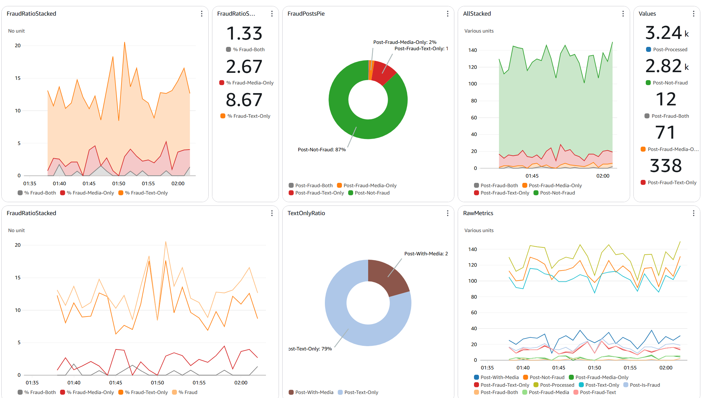
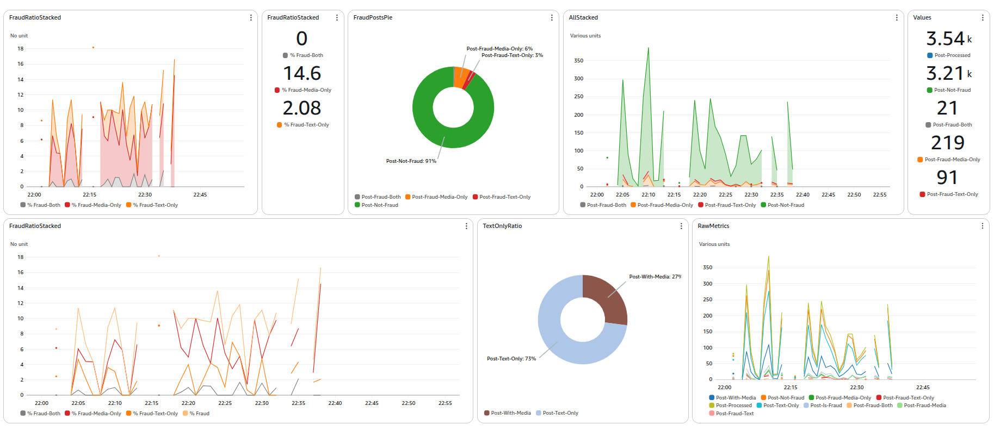

# Real-Time Fraud Detection Dashboard

This repository contains the **infrastructure-as-code (IaC)** for a real-time fraud detection dashboard built on **AWS**, designed to simulate real-world scenarios by ingesting live social media data from Bluesky. It also includes the CI/CD pipelines to automate the creation and teardown of the entire infrastructure.

> **Note:** This repository contains only the Terraform and Terragrunt code used for provisioning the infrastructure. The data processing scripts, SageMaker inference logic, and image build and deployment automation pipelines are maintained in a separate repository.

---

## Project Highlights

- **Real-Time Fraud Detection:**  
  Utilizes Amazon Kinesis Data Streams and AWS Lambda for ingesting and transforming social media text, images, and video data in real-time.

- **Machine Learning Inference:**  
  Streams are routed to Amazon SageMaker models for live inference, detecting fraudulent patterns with sub-second latency — supporting up to 3,000 records per minute.

- **Data Persistence and Offline Analysis:**  
  Processed results and media assets are delivered to S3 in Parquet format for long-term storage and batch analytics.

- **Monitoring and Observability:**  
  Track real-time metrics, monitor pipeline health, and visualize dashboards for operational transparency.

- **Infrastructure Automation:**  
  Entire AWS infrastructure is provisioned and managed using Terraform and Terragrunt, with GitHub Actions enabling CI/CD pipelines for consistent, reproducible deployments.

---

## Example Dashboard Views

Dashboard view of 10% data streaming (for testing purpose)

---

## Usage
- To deploy the infra, run Deploy the IaC in AWS workflow
- To destroy the infra, run Destroy the IaC in AWS workflow